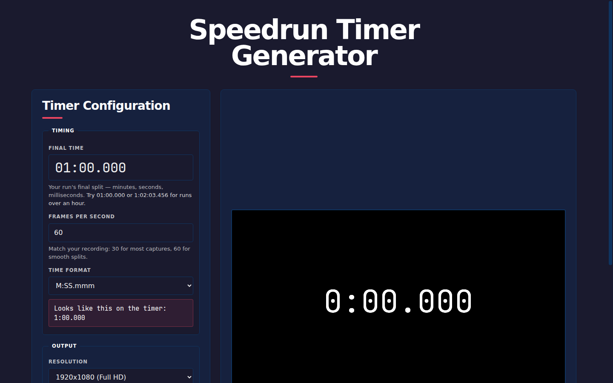
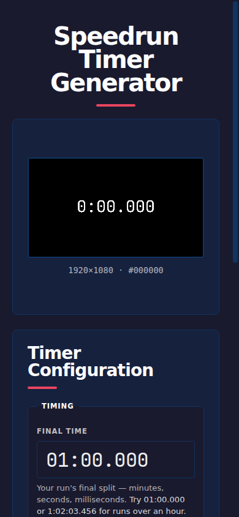

# Ztime — Speedrun Timer Generator

Generate pixel-accurate MP4 videos of a speedrun timer counting from 0 to your final split — frame-perfect, fully client-side, no upload.

## Features

- **Frame-accurate timing** — every frame lands on the exact millisecond grid for your FPS
- **Configurable FPS** — 1–240, including fractional rates (23.976, 29.97, 59.94)
- **Multiple resolutions** — HD 720p, Full HD 1080p, 4K
- **10 timer formats** — from `M:SS.mmm` to `H:MM:SS` and centisecond/decisecond variants
- **6 vendored monospace fonts** — JetBrains Mono, Space Mono, Share Tech Mono, Ubuntu Mono, Cascadia Code, VT323 — no system-font dependency
- **Hardware-accelerated encoding** — WebCodecs H.264 with realtime latency mode
- **100% offline** — no server, no CDN, no upload; everything runs in your browser
- **Live preview** — see the timer before you generate
- **Cancel anytime** — stop generation mid-encode without losing your config

## Screenshots

| Desktop | Mobile |
|---|---|
|  |  |

## Quick Start

```bash
# Clone and serve
git clone https://github.com/Zash60/Ztime.git
cd Ztime
node server.mjs
```

Open **http://127.0.0.1:8899/** in Chrome, Edge, or Safari.

Any static file server works — no build step, no dependencies.

## Configuration

| Option | Range | Default |
|---|---|---|
| Final time | `MM:SS.mmm` or `HH:MM:SS.mmm` | `01:00.000` |
| FPS | 1–240 | 60 |
| Resolution | 1280×720, 1920×1080, 3840×2160 | 1920×1080 |
| Background | Black, White, Red, Green, Blue | Black |
| Font family | 6 vendored monospace faces | JetBrains Mono |
| Font size | 8–200 px | 180 |
| Font color | Any hex color | `#ffffff` |
| Time format | 10 formats (mmm, cc, d, s, hmmm, hcc, hd, hs, ssmmm, sscc, ssd) | `M:SS.mmm` |

## How It Works

1. **Frame plan** — the generator computes exact display times for every frame, starting at `00:00.000` and ending precisely on your final split
2. **Canvas rendering** — each frame is painted on a `<canvas>` with the selected font, color, and format
3. **Hardware encode** — frames are fed to WebCodecs H.264 in realtime mode (no B-frames, no pipeline delay)
4. **MP4 muxing** — [Mediabunny](https://github.com/Vanilagy/mediabunny) (vendored, MPL-2.0) packages the encoded stream into a standards-compliant MP4
5. **Download** — the finished file saves directly to your device

## Browser Support

| Browser | Minimum version | Notes |
|---|---|---|
| Chrome | 94+ | Full hardware encode |
| Edge | 94+ | Full hardware encode |
| Safari | 16.4+ | Full hardware encode |
| Firefox | — | Not supported (no WebCodecs H.264 encoder) |

The app detects unsupported browsers and shows a clear message before you start.

## License

Code: MIT (see commit history). Fonts: SIL Open Font License 1.1 / Ubuntu Font License 1.0 (see `fonts/`). Mediabunny: MPL-2.0 (see `vendor/mediabunny/LICENSE`).
